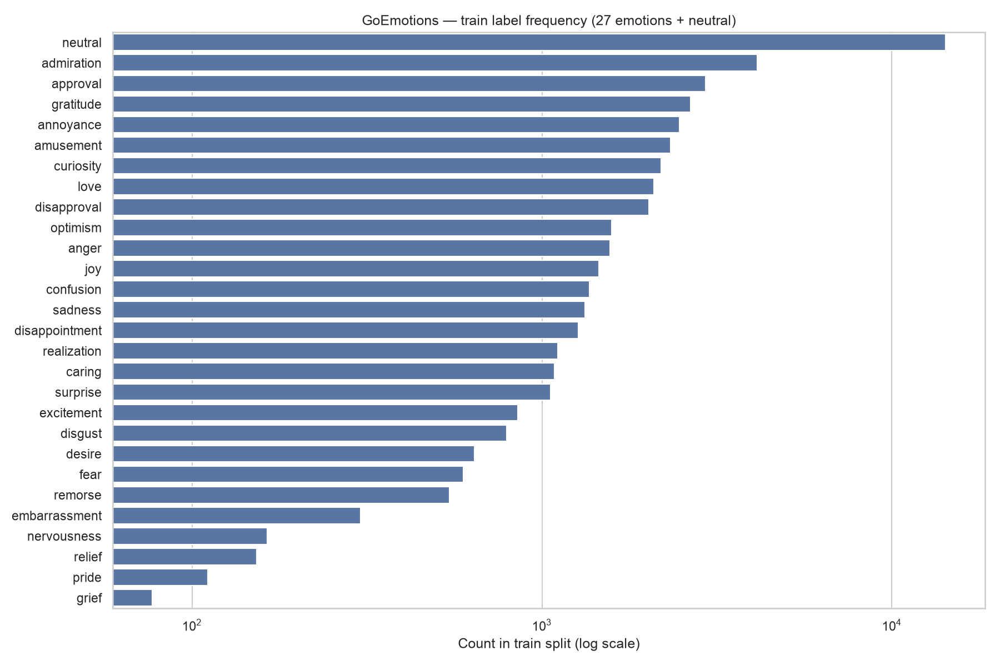
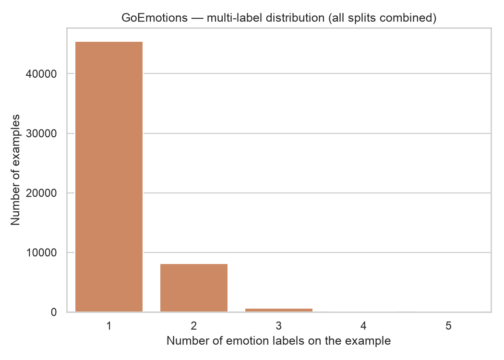
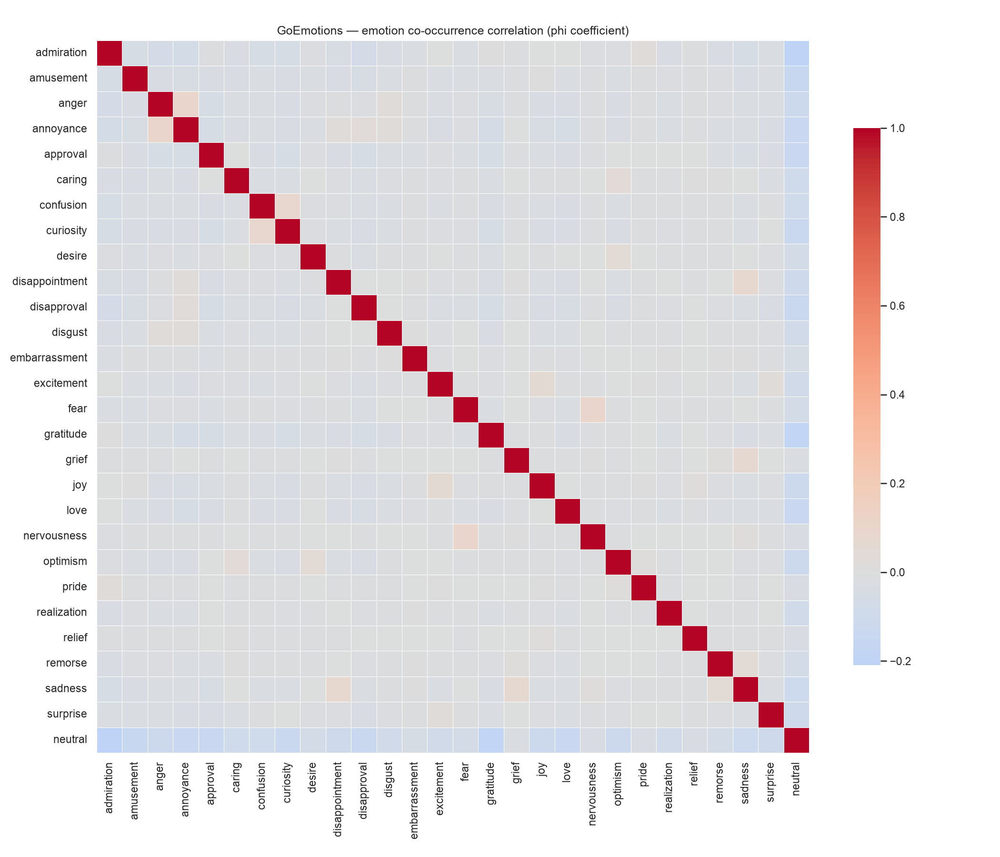

# Phase 2 — Dataset Deep Dive (EDA)

All numbers below were computed directly from
`google-research-datasets/go_emotions` (`simplified` config), loaded live
from the Hugging Face Hub — see `scripts/eda.py`. Raw outputs (CSVs, JSON
summary, full-resolution plots) are in `docs/assets/`.

## Dataset statistics

| Split | Examples |
|---|---|
| train | 43,410 |
| validation | 5,426 |
| test | 5,427 |
| **total** | **54,263** |

28 labels total: the 27 fine-grained emotions from Phase 1 plus `neutral`.
Zero examples have zero labels — every row has at least one label (`neutral`
absorbs anything that isn't emotionally marked), which simplifies the
multi-hot encoding in Phase 3: no "no-label" edge case to handle.

Text length (words, all splits combined): mean **12.8**, median **12**,
p95 **24**, max **33**. This is a short-text problem — the p95 of 24 words
means a tokenizer `max_length` of 32–48 subword tokens will cover the
overwhelming majority of examples without truncation for any of the models
under consideration, which matters directly for Phase 3's tokenization
config and for keeping Phase 6/7 training cheap.

## Class distribution & imbalance analysis

Train-split counts, most to least frequent:

| Rank | Label | Count | % of train |
|---|---|---|---|
| 1 | neutral | 14,219 | 32.76% |
| 2 | admiration | 4,130 | 9.51% |
| 3 | approval | 2,939 | 6.77% |
| 4 | gratitude | 2,662 | 6.13% |
| 5 | annoyance | 2,470 | 5.69% |
| ... | ... | ... | ... |
| 24 | embarrassment | 303 | 0.70% |
| 25 | nervousness | 164 | 0.38% |
| 26 | relief | 153 | 0.35% |
| 27 | pride | 111 | 0.26% |
| 28 | grief | 77 | 0.18% |

Full table: `docs/assets/label_distribution_train.csv`.

**Imbalance ratio: 184.7×** between the most frequent label (`neutral`,
14,219) and the rarest (`grief`, 77). This is the single most important
number from this phase — it directly determines the evaluation strategy in
Phase 9 (macro-F1 will be dominated by performance on classes the model may
see fewer than 100 times during training) and the training strategy in
Phases 6–8 (class weighting or focal loss is a real candidate, not a nice-to-
have, for `grief`/`pride`/`relief`/`nervousness`/`embarrassment` — the bottom
five classes all have under 310 training examples).

**Which emotions will be hardest to learn, and why:**

1. **`grief` (77 examples), `pride` (111), `relief` (153), `nervousness`
   (164), `embarrassment` (303)** — hardest by raw data volume alone. Any
   model, LLM or encoder, will struggle here unless the training recipe
   explicitly compensates (oversampling, class-weighted loss, or in the LLM
   case, over-representing these examples in the instruction dataset built
   in Phase 5).
2. **`grief` specifically is doubly hard**: not only is it the rarest class,
   it's also semantically close to `sadness` (the two are among the top
   co-occurring pairs below), which means the model has to learn a fine
   distinction from the *least* data of any class. Expect this to be the
   worst or near-worst per-class F1 in Phase 9's results, and the research
   report (Phase 12) should say so honestly rather than averaging it away
   under macro-F1.
3. **`neutral`, despite being the most frequent class, is not "easy."** It's
   a catch-all — closer semantically to "absence of a modeled emotion" — so
   it competes with 27 other classes for probability mass on genuinely
   ambiguous text. High recall on `neutral` is easy; high *precision* is
   where a model that over-predicts neutral on subtly emotional text will
   lose points.

## Multi-label distribution

| Labels on example | Count | % |
|---|---|---|
| 1 | 45,446 | 83.75% |
| 2 | 8,124 | 14.97% |
| 3 | 655 | 1.21% |
| 4 | 37 | 0.07% |
| 5 | 1 | 0.00% |

Mean labels/example: **1.176**. This confirms the framing from Phase 1: the
multi-label problem is real but is dominated by the single-label and
two-label cases — 98.7% of examples carry one or two labels. That has a
concrete design implication for Phase 5's instruction-format design: the
JSON output schema needs to handle 1–3 labels gracefully (with confidence
scores, per the project's target output format), but doesn't need to be
optimized for the 5-label tail, which is 1 example out of 54,263.

## Emotion co-occurrence (correlation)

Phi coefficient (Pearson correlation on the binary multi-hot matrix) between
every label pair. Top 10 most-correlated pairs — i.e., the pairs that
co-occur on the same example far more than chance would predict:

| Pair | Correlation |
|---|---|
| fear ↔ nervousness | 0.101 |
| anger ↔ annoyance | 0.101 |
| confusion ↔ curiosity | 0.083 |
| disappointment ↔ sadness | 0.074 |
| grief ↔ sadness | 0.067 |
| excitement ↔ joy | 0.055 |
| remorse ↔ sadness | 0.050 |
| desire ↔ optimism | 0.041 |
| caring ↔ optimism | 0.035 |
| annoyance ↔ disapproval | 0.028 |

Full pairwise table: `docs/assets/emotion_pair_correlations.csv`.

**Why this matters for the project, not just as trivia:**

- These correlations are all fairly weak in absolute terms (max 0.10),
  which tells us GoEmotions' 27 categories are largely *not* redundant —
  Google's annotation taxonomy did a reasonable job carving out
  near-orthogonal categories rather than 27 near-duplicates of the same 6
  Ekman emotions. That's a point in favor of using the full 27-way
  granularity as the headline result (Phase 9) rather than collapsing to
  Ekman-7 by default.
- The correlated pairs that do exist are exactly the semantically adjacent
  ones a human would predict (`fear`/`nervousness`, `anger`/`annoyance`,
  `grief`/`sadness`, `excitement`/`joy`) — this is a useful sanity check
  that the dataset's annotations are internally consistent, and it predicts
  where the confusion matrix in Phase 9 will show off-diagonal mass: expect
  `anger`↔`annoyance` and `grief`/`remorse`↔`sadness` to be the model's most
  common near-miss errors, not random noise.
- `neutral` correlates *negatively* with almost everything (visible as the
  blue row/column in the heatmap) — expected by construction, since an
  example is only labeled `neutral` when raters did *not* also assign an
  emotion label, but worth confirming rather than assuming, since a bug in
  the label pipeline would likely show up here first.

## Summary for Phase 3

- No missing/zero-label rows to handle.
- `max_length` of 32–48 tokens is sufficient for >95% of examples; no long-
  sequence handling needed.
- 184.7× class imbalance means class weighting (encoder baselines, Phase 4)
  and label-aware sampling in the instruction dataset (Phase 5) should be
  planned for now rather than retrofitted after a first training run
  underperforms on rare classes.
- 28-label multi-hot encoding is straightforward given the label set is
  fixed and every example has ≥1 label.

---

**Next up (Phase 3):** data engineering pipeline — cleaning, tokenization,
label transformation, multi-hot encoding, and the train/validation/test
split strategy, built as reusable pipeline code.

Ready for the next phase?
